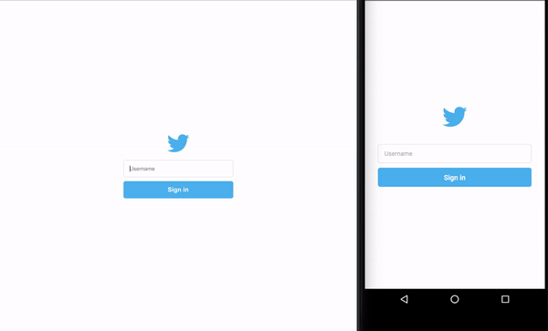

## Bwitter

### Node application using ReactJS in frontend and React Native to mobile application.
#### Using socket.io package to update in real-time new 'bweets'.
#### Usage
#####
Clone this repository into a folder. Enter in backend/ directory and install the dependencies with `yarn install` or `npm install`. After up the node application with `yarn start` or `npm start`. Make sure you change the url address to your mongodb server (Do that in backend/src/index.js file).
Do the same with the frontend/ folder.
To run mobile application, you will need a android/ios emulator. Install the dependencies like a node/react application, and run `react-native run-android` or `react-native run-ios`.

